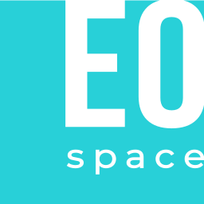

<h1 style="margin-top:0">EO Space demo app</h1>

A simple demonstration app created with Vue 3 (Options API) and Vuetify in Vite

  

Used technology stack: <b>Vue 3 (Options API), Vuetify, SCSS.</b>

